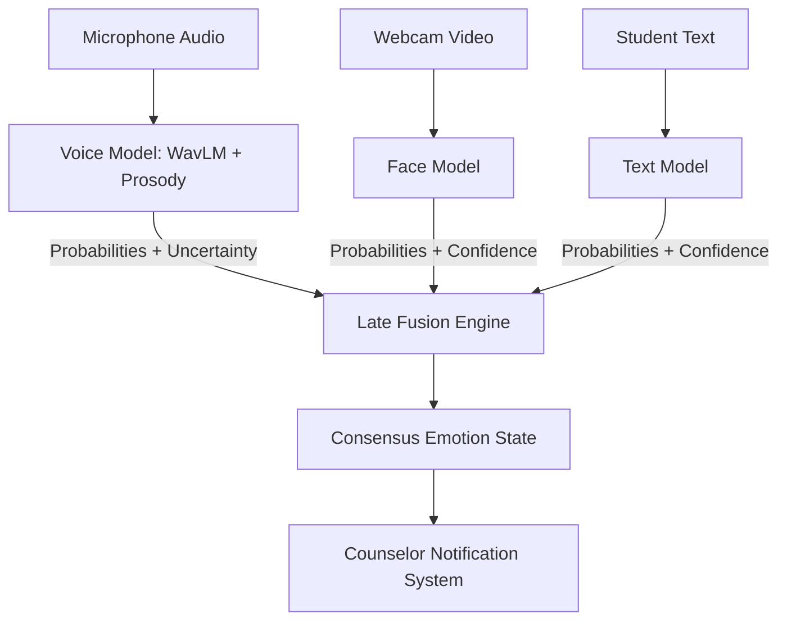

# Multimodal AI Emotional Wellbeing Monitoring System for Students

This project is a multimodal system designed to analyze student emotional states across audio, visual, and textual inputs to help school counselors and teachers identify students experiencing prolonged distress or anxiety.

## Overview

Student wellbeing often doesn't show up in just one place. A student might sound tired or stressed in their voice, look distressed on video, or write in a withdrawn tone. To handle this, we are building three separate emotion recognition models that will be combined using late fusion:

1. **Voice (Speech Emotion Recognition)**: Analyzes tone, pitch, energy, and speech acoustics. Located in `voice_model/`.
2. **Face (Facial Emotion Recognition)**: Analyzes facial cues and micro-expressions (currently in development).
3. **Text (Sentiment Analysis)**: Analyzes text input for emotional tone (currently in development).
4. **Multimodal Fusion**: Aggregates the predictions and uncertainty scores from all active modalities into a single assessment and flags potential concerns for counselors.

## Repository Layout

```
.
├── README.md                           # Main project overview
├── .gitignore                          # Ignores model weights and dataset files
├── voice_model/                        # Voice emotion recognition pipeline
│   ├── README.md                       # Voice model details and benchmark results
│   ├── SIGNALWELL_VOICE_PIPELINE.py    # Training and inference script
│   ├── SIGNALWELL_VOICE_COLAB.ipynb    # Google Colab notebook (T4 GPU ready)
│   ├── requirements.txt                # Python dependencies
│   ├── sample_1.wav                    # Test audio sample
│   ├── sample_2.wav                    # Test audio sample
│   └── sample_3.wav                    # Test audio sample
├── face_model/                         # Face emotion module (in progress)
├── text_model/                         # Text emotion module (in progress)
└── multimodal_fusion/                  # Late fusion logic (to be added)
```

## System Workflow



## Current Status

- **Voice Model**: Complete. Trained and evaluated on combined speech datasets (RAVDESS, CREMA-D, TESS, SAVEE) with a speaker-independent test split, reaching 68.3% Macro F1 and 68.2% test accuracy. See `voice_model/` for code and instructions.
- **Face Model**: In progress.
- **Text Model**: In progress.
- **Fusion Engine**: Scheduled after all three modality baselines are ready.

## Team

- Siva Sethamanyu ([@SivaSethamanyu](https://github.com/SivaSethamanyu)) - Voice emotion recognition model
- Shamith ([@Shamith-247](https://github.com/Shamith-247)) - Face emotion recognition & text sentiment models
