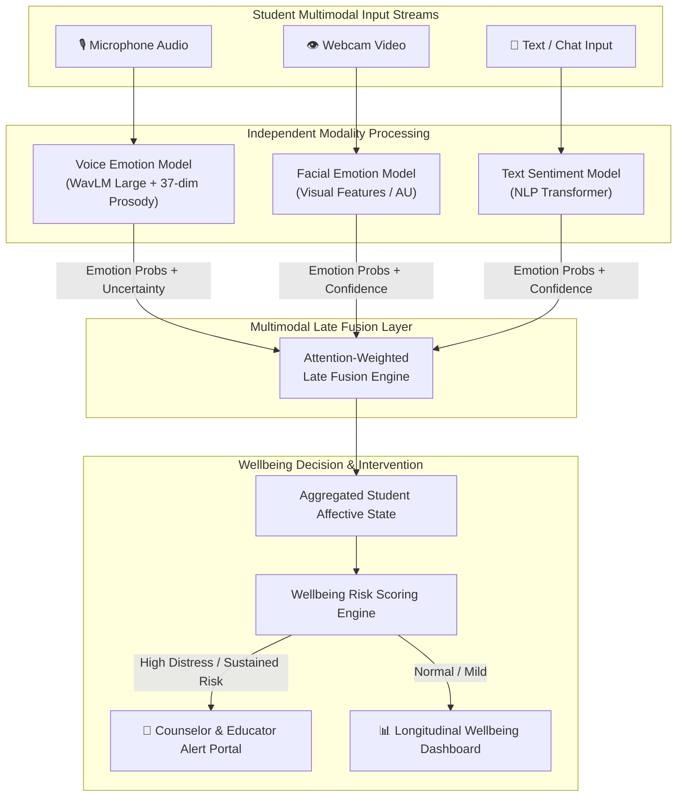

# Multimodal AI-Based Emotional Wellbeing Monitoring System for Students

An intelligent multimodal emotional wellbeing monitoring framework designed to assess student emotional states and alert counselors or teachers in real time.

---

## 🎯 Project Overview

In educational environments, early detection of negative affective states (such as prolonged sadness, extreme anxiety, fear, or distress) is critical for timely student counseling and intervention. 

This system employs a **Modular Late-Fusion Multimodal Architecture** that processes three distinct modalities:
1. **🎙️ Voice (Speech Emotion Recognition)**: Acoustic prosody & self-supervised speech representations (WavLM).
2. **👁️ Face (Facial Expression Recognition)**: Visual facial cues and micro-expressions.
3. **💬 Text (Linguistic Sentiment Analysis)**: Contextual sentiment and semantic affect from student communication.

---

## 🏗️ System Architecture



---

## 📁 Repository Structure

```text
MULTIMODAL-AI-BASED-EMOTIONAL-WELLBEING-MONITORING-SYSTEM-FOR-STUDENTS/
│
├── README.md                           # Main Multimodal Project Documentation
├── .gitignore                          # Global rules ignoring large checkpoints & datasets
│
├── voice_model/                        # 🎙️ Voice Emotion Recognition (SignalWell Voice)
│   ├── README.md                       # Comprehensive Voice module docs & benchmarks
│   ├── SIGNALWELL_VOICE_PIPELINE.py    # Master training, evaluation & inference pipeline
│   ├── SIGNALWELL_VOICE_COLAB.ipynb    # All-in-one GPU Colab training & inference notebook
│   ├── requirements.txt                # Voice dependencies (torch, transformers, librosa)
│   ├── sample_1.wav                    # Benchmark test sample 1
│   ├── sample_2.wav                    # Benchmark test sample 2
│   └── sample_3.wav                    # Benchmark test sample 3
│
├── face_model/                         # 👁️ Facial Emotion Recognition (In Development)
│   └── (To be added)
│
├── text_model/                         # 💬 Text Sentiment Analysis (In Development)
│   └── (To be added)
│
└── multimodal_fusion/                  # 🔗 Late-Fusion & Alerting Portal (Planned)
    └── (To be added)
```

---

## 🚀 Active Modules

### 1. Voice Emotion Recognition (`voice_model/`) — ✅ Complete & Benchmarked
* **Architecture**: Dual-branch hybrid fusing **WavLM Large SSL embeddings** (`1024-dim`) with **Physiological Prosodic Features** (`37-dim`) passed through a **3-Layer Pre-LN Temporal Transformer** with **Attention Pooling** and an **Uncertainty Quantification Head**.
* **Benchmark Results (Speaker-Independent across RAVDESS, CREMA-D, TESS, SAVEE)**:
  * **Test Accuracy**: `68.20%`
  * **Test Macro-F1**: `68.32%`
  * **Test UAR**: `67.49%`
* For details, see [voice_model/README.md](voice_model/README.md).

---

## 👥 Contributors & Responsibilities

* **Voice Emotion Recognition Module**: Siva Sethamanyu ([@SivaSethamanyu](https://github.com/SivaSethamanyu))
* **Facial Emotion & Text Sentiment Modules**: Shamith ([@Shamith-247](https://github.com/Shamith-247))
* **Multimodal Fusion & Integration**: Joint Team Effort
